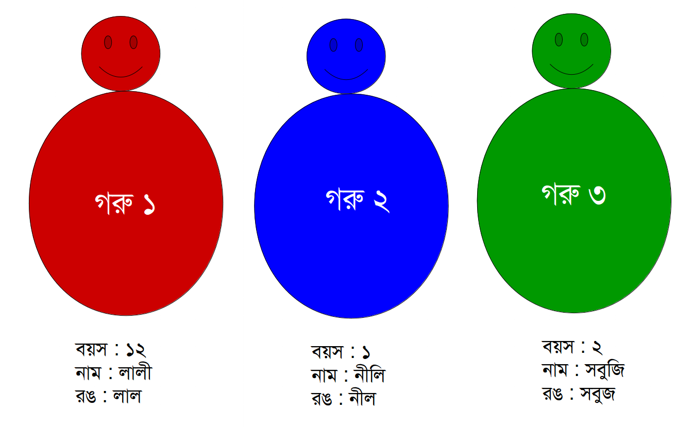

# স্ট্রাকচার

## স্ট্রাকচার কি?

সি প্রোগ্রামিংয়ে স্ট্রাকচার হচ্ছে এক ধরনের ইউজার ডিফাইন্ড ডাটা টাইপ। আবার একে বিভিন্ন ডাটা টাইপের একটি কালেকশনও বলা যেতে পারে।

## এত কিছু থাকতে স্ট্রাকচার কেন?

ধরা যাক, আমাদের কাছে কয়েকটা গরুর বয়স, নাম(কল্পিত) এবং রঙ দেয়া আছে। আমরা চাচ্ছি সবগুলো ডাটা স্টোর করে রাখতে। কিভাবে কাজটা করা যেতে পারে? ধরা যাক, আমরা তিনটা গরুর জন্য উপরের ডাটাগুলো স্টোর করে রাখতে চাই। তাহলে কি ৩\*৩ = ৯ টা আলাদা ভ্যারিয়েবল ডিক্লেয়ার করে একটা একটা করে ভ্যালু এসাইন করে দিব? হ্যাঁ করা যেতেই পারে(!) কিন্তু গরুর সংখ্যা যদি বেড়ে ১০০ হয়ে যায়? ৩০০ ভ্যারিয়েবল ডিক্লেয়ার নিশ্চয়ই কেউ করতে চাইব না। কোনো ভাবে অনেক ধৈর্য নিয়ে যদি করাও যায়, তবুও এত গুলো গরুর জন্য স্পেসিফিক কোন গরুর রেফারেন্সে স্পেসিফিক কোন ডাটার রেফারেন্স রাখা কি খুব সহজ হবে? হবে না! কেউ কেউ হয়ত ভাবছি আমরা তিনটা অ্যারে ডিক্লেয়ার করলেই তো পারি! হ্যাঁ, থিওরিটিকালি পারি। আবার কোন কোন সময় পারিও না! কেন পারিনা তা আমরা যখন লিংকড লিস্ট পড়ব তখন দেখে নেব। আবার, আমরা যদি 'গরু১', 'গরু২', 'গরু৩' নামে মাত্র তিনটি ভ্যারিয়েবল দিয়েই কাজটা করা যেত? ব্যাপারটা সহজ হত না!

Here comes **Structure** for you.

সোজা বাংলায় বলতে গেলে স্ট্রাকচার দিয়ে আমরা খুব সহজেই উপরের সব বৈশিষ্ট্যসহ একটি গরু বানিয়ে ফেলতে পারি। এবার দেখে নেয়া যাক কিভাবে আমরা কাজটা করতে পারি।

## স্ট্রাকচারের ব্যবহার

একটি স্ট্রাকচার ডিফাইন করতে আমাদের একটি কি-ওয়ার্ড লাগে। কি-ওয়ার্ড টি হচ্ছে:

```c
                                         struct
```

এই কি-ওয়ার্ডটি দিয়েই আমরা নিজেদের ইচ্ছামত/প্রয়োজনমত একটি নতুন টাইপের 'গরু' আই মিন ডাটা টাইপ বানিয়ে ফেলতে পারি। যেহেতু আমরা হচ্ছি ইউজার, আর এটা আমাদের ডিফাইন করা ডাটা টাইপ, তাই এটি ইউজার ডিফাইন্ড ডাটা টাইপ।

এবার দেখা যাক আমরা উপরের বৈশিষ্ট্যগুলো সহ একটা গরু কিভাবে বানাতে পারি!

```c
struct Goru
{
    int boyos;
    char nam[10];
    char rong[20];
};
```

খুবই সহজে এভাবে স্ট্রাকচার দিয়ে আমরা গরু, হাতি, ডায়নোসরসহ আমাদের ইচ্ছামত যা খুশি বানিয়ে ফেলতে পারি। এখানে প্রথম লাইনের **struct Goru** মানে হচ্ছে আমরা **Goru** টাইপের ডাটা বানিয়ে ফেলেছি যার ভেতরে **boyos, nam, rong** নামের কয়েকটি বৈশিষ্ট্য আছে। এই বৈশিষ্ট্যগুলোকে প্রোগ্রামিংয়ের কনটেক্সটে কোন স্ট্রাকচারের member বলা হয়। আমরা স্ট্রাকচারের কোন ভ্যারিয়েবল ইনিশিয়ালাইজ(ডিক্লেয়ার আর কি) করে এই মেম্বারদের অ্যাক্সেস করতে পারি এবং ম্যানিপুলেট করতে পারি। ওহ, আরেকটা ব্যাপার, স্ট্রাকচারের শেষের কার্লি ব্রেসের পরের সেমিকোলন দিতে আমরা অনেকসময় ভুলে যাই। এটা ভুলে গেলে চলবে না। স্ট্রাকচার কোন ফাংশান না। এটি একটি স্ট্যাটমেন্টের মতই কাজ করে। তাই, সেমিকোলন ব্যবহার করা বাঞ্ছনীয়।

এবার নিচের ছবিটি লক্ষ্য করা যাকঃ



উপরের ছবিতে অদ্ভুত দর্শন যে তিনটি স্ট্রাকচার দেখে যাচ্ছে ধরে নেয়া যাক এইগুলো আমাদের গরু। তিনটি গরুরই বৈশিষ্ট্য একই রকম যেরকম আমরা উপরে স্ট্রাকচারটি ডিফাইন করে এসেছি। এবার সি প্রোগ্রামের কনটেক্সটে দেখে নেয়া যাক আমরা কিভাবে এর কোড করতে পারি।

```c
#include <stdio.h>
#include <string.h>

struct Goru
{
    int boyos;
    char nam[10];
    char rong[20];
};

int main()
{
    struct Goru goru1;
    struct Goru goru2;
    struct Goru goru3;

    //Assigning data for Goru 1

    goru1.boyos = 12;
    strcpy(goru1.nam, "Lali");
    strcpy(goru1.rong, "Lal");


    printf("Name: %s\nColor: %s\nBoyos: %d\n",goru1.nam, goru1.rong, goru1.boyos);

    //Assign data for Goru 2 and Goru 3 the same way as Goru 1
    //Your code goes here...

    return 0;

}
```

এখানে main() এর শুরুতে আমরা প্রথমেই তিনটি গরুর জন্যে তিনটি ভ্যারিয়েবল ডিক্লেয়ার করে নিয়েছি ঠিক যেভাবে আমরা কোন ভ্যারিয়েবল ডিক্লেয়ার করি। তারপর আমরা একে একে গরুর সবগুলো ডাটা এসাইন করে দিয়েছি। এখানে একটা বিষয় লক্ষণীয় যে, কোন স্ট্রাকচারের মেম্বারকে এক্সেস করতে সাধারণত **'.' (ডট)** অপারেটর ব্যবহার করা হয়। আমরা যখন লিখছি goru1.boyos তার মানে হল আমরা ঐ স্ট্রাকচারের মেম্বার boyos কে এক্সেস করেছি। তারপর ঐ মেম্বারের জন্য একটি ডাটা ১২(গরুর বয়স) এসাইন করে দিয়েছি। পরের দুই লাইনে নাম ও রঙের জন্য যেই দুটি মেম্বার ছিল সে দুটির জন্য দুটি স্ট্রিং এসাইন করেছি। ঠিক একইভাবে আমরা প্রিন্ট ফাংশানে **ডট** অপারেটর দিয়ে স্ট্রাকচারে থাকা এলিমেন্টগুলোর ভ্যালু প্রিন্ট করেছি। এখন মনে হয়ত প্রশ্ন জাগতে পারে যে শেষমেশ তো একটি গরুর জন্য তিনটি ফিল্ড নিয়েই কাজ করতে হচ্ছে। তাহলে স্ট্রাকচার ব্যবহার করে আমাদের লাভটা কি হল? আসলে একটু লক্ষ্য করলেই দেখা যাবে আমাদের কিন্তু তিনটি ফিল্ড তিনটি গরুর জন্য আলাদাভাবে ডিক্লেয়ার করতে হয় নি বরং আমরা একটি গরুর জন্য একটি ভ্যারিয়েবলই ডিক্লেয়ার করেছি। কারণ, আমরা প্রথম যখন স্ট্রাকচারটি বানিয়েছি তখনই বলে দিয়েছি এর বৈশিষ্ট্যগুলো কি হবে মানে এতে কোন কোন এলিমেন্ট থাকবে। যে কারণে পরবর্তীতে আমরা যখনই ঐ স্ট্রাকচারের একটি ভ্যারিয়েবল ডিক্লেয়ার করছি তখন অটোমেটিকালিই এই তিনটি বৈশিষ্ট্যই আমাদের ভ্যারিয়েবলের সাথে চলে এসেছে যা আমরা **ডট** দিয়ে এক্সেস করতে পারি। আর সে কারণেই একটি ভ্যারিয়বল ডিক্লেয়ার করে তিনটি জিনিসই আমরা রাখতে পারছি। এভাবে কোন ভ্যারিয়েবলের রেফারেন্স রাখাও বেশ সহজ। আশা করি স্ট্রাকচারের সুবিধা আমরা সবাই মোটামুটি আন্দাজ করতে পারছি। এবার তোমরা একইভাবে গরু ২ এবং ৩ এর জন্য ভ্যালু এসাইন করে প্রিন্ট করার চেষ্টা কর। পরবর্তী চাপ্টারে আমরা দেখার চেষ্টা করব যে, কিভাবে স্ট্রাকচারের পয়েন্টার নিয়ে কাজ করা যায়।
