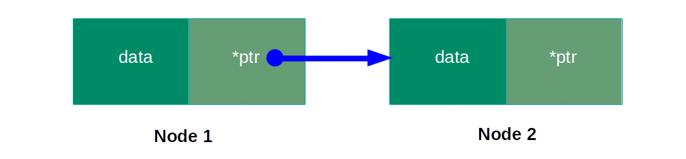
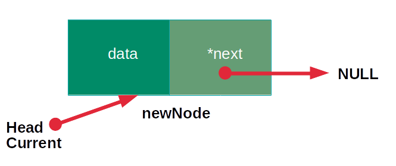
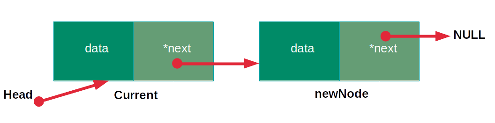
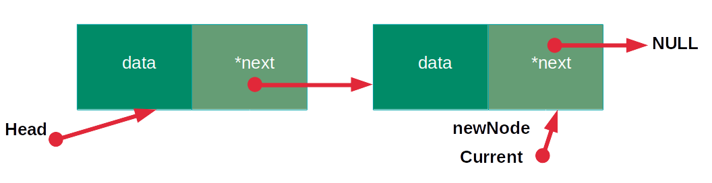

# Singly Linked List

### Singly Linked List

আগের অধ্যায়ে আমরা লিংকড লিস্টের যেসব বৈশিষ্ট্য নিয়ে আলোচনা করেছি মোটের উপর সেইসবগুলোই একটি **Singly Linked List** এর বৈশিষ্ট্য। আমরা পরবর্তী সব জায়গায় একে সংক্ষেপে **SLL** ডাকব। **SLL** হল এক ধরণের ডাটা স্ট্রাকচার যেখানে লিস্টের প্রতিটি নোডে ডাটা স্টোর এবং পরবর্তী নোডের রেফারেন্স রাখা হয়। আগের অধ্যায় যদি ঠিকঠাক বুঝে থাক, তাহলে নিশ্চয়ই বুঝতে পারছ স্ট্রাকচারটি কি রকম হবে। আমাদের এমন একটি স্ট্রাকচার ডিফাইন করতে হবে যে স্ট্রাকচারে আমরা ডাটা এবং একই টাইপের পরবর্তী নোডের এড্রেস রাখতে পারব।

### SLL এর স্ট্রাকচার

ধরা যাক আমরা কিছু ইন্টিজারের জন্য লিংকড লিস্ট বানাব। তাহলে আমাদের স্ট্রাকচার টা কি রকম হবে? নিচের কোডটা দেখার আগে একটু ভাব!

```c
struct Node
{
    int data;
    struct node *ptr;
};
```

এখানে আমরা N**ode** নামে একটি স্ট্রাকচার ডিফাইন করেছি। যার ভিতরে দুইটি ফিল্ড আছে। প্রথমটি ডাটা রাখার জন্য সেটা বুঝতে আশা করি কারোরই প্রবলেম থাকার কথা না। তবে দ্বিতীয় লাইনটি কনফিউজিং! আমি জানি, তুমি যদি এর আগে লিংকড লিস্টের কোড করে না থাক, তবে তোমার মনে প্রশ্ন জাগতেই পারে যে আমরা **struct Node** এর ভিতরে আবার **struct Node** কিভাবে লিখলাম! Here comes the fun part! একটু মনোযোগ দিয়ে লক্ষ্য কর, আমরা যখন কোন ইন্টিজারের জন্য পয়েন্টার ডিক্লেয়ার করতাম, তখন কি করতাম? সাধারণভাবেই আমরা লিখতাম,

```c
int *ptr;
```

তাইনা? অবশ্যই তাই। কারণ আমরা তো একটি ইন্টিজার ভ্যারিয়েবলের রেফারেন্স এই পয়েন্টারে রাখব। সেক্ষেত্রে অবশ্যই ব্যাপারটা এরকমই হবে। এবার আমাদের স্ট্রাকচারটার দিকে লক্ষ্য কর। আমরা আমাদের নোডে কার রেফারেন্স রাখব? অবশ্যই সেইম টাইপের আরেকটি নোডের, তাইনা? সেইম টাইপের আরেকটি নোডের জন্য তো স্ট্রাকচারও সেইম হবে। আর সে জন্যে আমাদের পয়েন্টারের ডাটা টাইপও তো আমাদের নোডের(মানে ডিফাইন করা স্ট্রাকচারের) মতই হবে। ব্যাপারটা তো এমনই হওয়ার কথা। আসলেও তাই। সে কারণেই আমরা আমাদের নোডের পয়েন্টারের টাইপও আমাদের নোডের টাইপই হয়। তাই আমরা লিখি,

```c
struct Node *ptr; //where (struct node) is the Data Type
```

এই জিনিসটি যদি আমরা ভিস্যুয়ালাইজ করি, তবে দুইটি নোডের ক্ষেত্রে আমরা নিচের ছবিটি দেখতে পাবঃ



এখানে আমাদের হাতে দুইটি নোড আছে। দুইটি নোডই উপরে ডিফাইন করা স্ট্রাকচার থেকে তৈরি এতে আশা করি কারও কোন সন্দেহ নেই। এবার একটা জিনিস লক্ষ্য কর যে, প্রথম নোডের পয়েন্টারটি কিন্তু দ্বিতীয় নোডকে পয়েন্ট করে আছে। মানে সে দ্বিতীয় নোডের এড্রেসকে ধরে রেখেছে। এখন তোমার কাছে আমার প্রশ্ন হচ্ছে যে, দ্বিতীয় নোডের টাইপ কি? অবশ্যই তুমি যা ভাবছ তাই। এখানে দুটি নোডের টাইপই এক এবং তা হল **struct Node.** আর আমরা যদি কোন পয়েন্টারে এই নোডের রেফারেন্স রাখতে চাই তাহলে অবশ্যই সে পয়েন্টারের টাইপও তো তাই হবে। সে কারণেই আমাদের পয়েন্টারের টাইপ **struct Node.** এবার নিশ্চয়ই এই ব্যাপারে আর কোন ঝামেলা থাকার কথা না। তাই যদি হয় তবে এবার **SLL** তৈরি করা শেখা যাক।

### SLL তৈরি করা

**SLL** তৈরি করার আগে আমাদের কয়েকটা জিনিস মাথায় রাখতে হবে।

* লিস্ট তৈরির শুরুতেই আমরা নোড টাইপের একটি পয়েন্টার \***head** ডিক্লেয়ার করে নেব। এই **head** আমাদের প্রথম নোডের এড্রেস ধরে রাখবে। পরবর্তীতে আমরা যখনই লিস্ট ট্রাভার্স করব বা লিস্টে কোন রকম ম্যানিপুলেশান করব, তখন এর মাধ্যমেই করব। ইনিশিয়ালি আমরা এতে **NULL** সেট করে রাখব যাতে আমরা চেক করতে পারি আমাদের লিস্টে কোন এলিমেন্ট আছে কি না!
* এরকমই আরেকটি পয়েন্টার নিব **\*current. current** এর কাজ হচ্ছে লাস্ট কোন নোড পর্যন্ত আমরা কাজ করেছি তার এড্রেস ধরে রাখা। এতে করে আমরা যখনই নতুন কোন নোড লিস্টে যোগ করব, তখন **current** এর পয়েন্টারে নতুব নোডটার এড্রেস এসাইন করে দিলেই হবে।&#x20;
* আমরা প্রতিবার নতুন যেই নোডটা তৈরি করব, ইনিশিয়ালি তার পয়েন্টার পার্টটাতে **NULL** এসাইন করে রাখব। কারণ, সেটা তো তখন শেষ নোডই। আর আমরা জানি শেষ নোডের পয়েন্টার সবসময় **NULL** থাকবে যাতে আমরা বুঝতে পারি এটাই লিস্টের শেষ।

এবার আমাদের লিংকড লিস্টের জন্য কিছু কোড লিখা যাক এবং সেই কোডকে অস্ত্রোপাচার করে দেখা যাক আসলে আমরা কি করছি!

প্রথমেই আমরা লিস্টের জন্য একটি স্ট্রাকচার ডিফাইন করে নিব।

```c
struct node
{
    int data;
    struct node *next;
};

struct node *head = NULL;
struct node *current = NULL;
```

এখানে আমরা আগের মতই একটি স্ট্রাকচার ডিফাইন করেছি যাতে একটি ইন্টিজার ভ্যারিয়েবল এবং একটি পয়েন্টার আছে যা পরবর্তী নোডের এড্রেস রাখবে। আমরা আমাদের স্ট্রাকচার **node** টাইপের দুইটি পয়েন্টার **\*head** এবং **\*current** ডিক্লেয়ার করেছি। ইনিশিয়ালি আমরা এদের **NULL** দিয়ে এসাইন করে রেখেছি কারণ ইনিশিয়ালি যেহেতু আমাদের কোন লিস্ট নেই সেহেতু অবশ্যই আমাদের কোন হেড কিংবা কারেন্টও নেই। এবার নিচের কোডটা লক্ষ্য করা যাকঃ

```c
int main()
{
    struct node* newNode = (struct node*)malloc(sizeof(struct node));

    if(newNode == NULL)
    {
        printf("Memory allocation failed!\n");
        exit;
    }

    newNode->data = 5;
    newNode->next = NULL;

    if(head == NULL)
    {
        head = newNode;
        current = newNode;
    }

    return 0;
}
```

এই কোডটি উপরের স্ট্রাকচার থেকে লেখা। এখানে আমরা প্রথমেই একটি নোড **newNode** এর জন্য ডায়নামিকালি মেমোরি এলোকেট করেছি। আমরা জানি, **malloc()** ফাংশান যদি কোন কারণে মেমোরি এলোকেট করতে না পারে তখন **NULL** রিটার্ন করে। তাই পরের লাইনে আমরা টেঁস্ট করছি যে **malloc() NULL** রিটার্ন করছে কি না। তার পরের লাইনে আমরা নতুন নোডের ভ্যালু ৫ এসাইন করে দিচ্ছি এবং উপরের শর্তানুযায়ী ইনিশিয়ালি এর পয়েন্টারকে **NULL** করে দিচ্ছি। এর পরের লাইনে আমরা টেস্ট করছি যে **head** কি **NULL** কি না। যেহেতু এটা আমাদের প্রথম নোড সেহেতু **head**, **NULL**-ই থাকবে। আর তাই এটাই আমাদের হেড। আমরা তাই **head** এ এই নতুন নোডের এড্রেস এসাইন করে দিচ্ছি। আবার যেহেতু এখন এটিই লিস্টে আমাদের একমাত্র নোড তাই আমরা **current** হিসেবেও নতুন নোডটির এড্রেসই এসাইন করে দিয়েছি। এটা তো গেলো শুধু প্রথম নোডের ক্ষেত্রে। এখন পরবর্তী নোডগুলোর ক্ষেত্রে আমরা কি করতে পারি?

আসলে পরবর্তী সকল নোডের ক্ষেত্রে আমরা একই রকম কাজ করব। সেক্ষেত্রে আমাদের **if** এর পরে একটি **else case** জুড়ে দিতে হবে। এবং সেখানে আমরা বলে দিব বাকি সকল নোডের জন্য আমরা কি করব। বাকি সকল নোডের ক্ষেত্রে আমরা যা করব তা হল নতুন নোডের এড্রেস আমরা আমাদের লাস্ট নোড**(current)** এর পয়েন্টারে এসাইন করে দিব মানে **current -> next = newNode** করে দিব। এবং যেহেতু তখন নতুন নোডটিই আমাদের শেষ নোড, তাই আমরা **current** কে আপডেট করে দিয়ে নতুন নোডের এড্রেস **current** এ এসাইন করে দিব। আরেকটা ব্যাপার হচ্ছে আমরা এই সবটা কাজই তো ডায়নামিকালি করব। তাহলে আমরা কোডটা এমনভাবে লিখব যাতে করে আমরা স্বয়ংক্রিয় ভাবেই নোডগুলো একের পর এক সাজাতে পারি। সেক্ষেত্রে আমরা একটি কাজ করতে পারি সেটি হচ্ছে, ইউজার থেকে প্রথমেই ইনপুট নিয়ে নিব যে আমাদের লিস্টে টোটাল নোড কয়টি হবে। সে অনুযায়ী নিচে একটি কোড লেখা হলঃ

```c
#include <stdio.h>
#include <stdlib.h>

struct node
{    
    int data;
    struct node *next;
};

struct node *head = NULL;
struct node *current = NULL;

int main()
{
    int n;
    printf("Enter how many nodes you want to create: ");
    scanf("%d", &n);

    while(n--)
    {

        struct node* newNode = (struct node*)malloc(sizeof(struct node));

        if(newNode == NULL)
        {
            printf("Memory allocation failed!\n");
            exit;
        }

        newNode->next = NULL;

        printf("Enter data for new node: ");
        scanf("%d", &newNode->data);

        if(head == NULL)
        {
            head = newNode;
            current = newNode;
        }

        else
        {
            current->next = newNode;
            current = newNode;
        }
    }

    return 0;


}
```

এখানে আমরা যে কাজটি করেছি সেটি হল প্রথমেই ইউজার থেকে ইনপুট নিয়ে নিয়েছি যে আমরা কয়টি নোড তৈরি করব। ইনপুট যত হবে আমাদের নোডও ততটি তৈরি হবে মানে লুপ ততবার চলবে। লুপের শুরুতে আমরা **newNode** এর জন্যে মেমোরি এলোকেট করেছি। তারপর ইনিশিয়ালি নতুন নোডের পয়েন্টারকে **NULL** করে দিয়েছি এবং নতুন নোডের জন্য ভ্যালু ইনপুট নিয়েছি। এর পরের লাইনে আমরা টেস্ট করছি যে **head, NULL** কিনা। **head** যদি **NULL** হয় তবে আমাদের নতুন নোডই হেড, এবং যেহেতু আমাদের লিস্টে আপাতত আর কোন নোড নেই তাই সেটিই শেষ নোড বা **current.** এখন যেহেতু আমাদের হেড আর **NULL** না, তাই এই প্রোগ্রামের রানটাইমে আর কোন বার এই টেস্ট কেস পাস করবে না। এবং আমরা **else case** এ চলে যাব। সেখানে আমরা লাস্ট নোড এর পয়েন্টারে নতুন নোডের রেফারেন্স দিয়ে দিচ্ছি মানে **current -> next = newNode** করে দিচ্ছি। এর মানে হল আমরা লাস্ট নোডের পয়েন্টারে আমাদের নতুন নোডের এড্রেস দিয়ে দিচ্ছি বা লিংক তৈরি করছি। আর যেহেতু তখন এই নতুন নোডটিই আমাদের শেষ নোড তাই **current** এর রেফারেন্সও আপডেট করে দিচ্ছি। নিচের ভিজ্যুয়ালাইজেশানটি দেখলে আশা করি ব্যাপারটি আরও পরিষ্কার হয়ে যাবে।

## _When \*head is NULL:_



## _When \*head is not NULL(Assigning reference of newNode to current->next):_

## _Updating \*current:_

## 

এবার নিজে নিজে এই কোডটি লিখে ফেল।

### **৫.৪ SSL প্রিন্টিং/ট্রাভার্সিং**

**SSL** ট্রাভার্সিং এর ক্ষেত্রে আমরা **head** থেকে শুরু করে যতক্ষণ না পর্যন্ত ট্রাভার্সিং নোডের রেফারেন্সে **NULL** না পাব ততক্ষণ পর্যন্ত লুপ চালিয়ে যাব। আর প্রতি ইটারেশান শেষে নোডের রেফারেন্স পরবর্তী নোডের রেফারেন্সে আপডেট করব। এবার নিচের কোডটি দেখার আগে নিজে একটু চেষ্টা করে দেখে নিতে পার।

```c
void printList(struct node* temp)
{
    while(temp!=NULL)
    {
        printf("%d\t", temp->data);
        temp = temp->next;
    }
}
```

এখানে **printList()** ফাংশানটিতে আর্গুমেন্ট হিসেবে লিস্টের **head** কে পাঠাতে হবে। তারপর আমরা হেড থেকে শুরু করে প্রতিটি নোডের ডাটা প্রিন্ট করব এবং প্রিন্ট করা শেষে পরবর্তী নোডের এড্রেস হিসেবে আমাদের ট্রাভার্সিং নোডকে আপডেট করব। এরকম করে চলতে থাকবে যতক্ষণ না পর্যন্ত **NULL** পাওয়া যায়। নাল পেলে বুঝতে হবে এটিই আমাদের লিস্টের শেষ, তখন লুপ ব্রেক করবে এবং ফাংশানের কাজ শেষ হবে।
